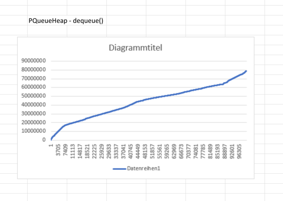

# Übung 3 - Lösung

## 1. Prioritätswarteschlangen (src/)

### Lösungsidee
Eine Klasse binäre Heap - PQueueHeap und eine Klasse  DHeapQueue mit der gleichen Schnittstelle werden implementiert. Binäre Heap hat genau zwei Nachfolger. Bei d-äre Heap besitz innere Knoten 4 Nachfolger. In beiden Klassen werden ArrayList verwendet um zu die Daten zu speichern. Methode enqueue dient die Werte in ArrayList zu speichern. Zuerst wird neue Wert am Ende des Array gespeichert und dann wird vergliechen und falls neue Wert grösser als parent Element, wird sie getauscht. Peek() methode dient  der Top element - grösste Element abzufragen ohne zu entnehmen. Das entnehmen passiert über dequeue. Nach dem entnehmen wird der grösste Element in der erste index gestezt.

Ich habe für die Operationen enqueue() und dequeue() eine ausführliche Komplexitätsanalyse durchgeführt. Leider kann ich nichts über asymptotische Laufzeitkomplexität schreiben, weil ich von diesen Ergebnisse nichts verstehe(wegen Mathe).
### Testfälle

